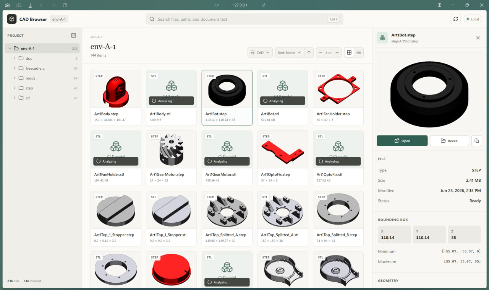
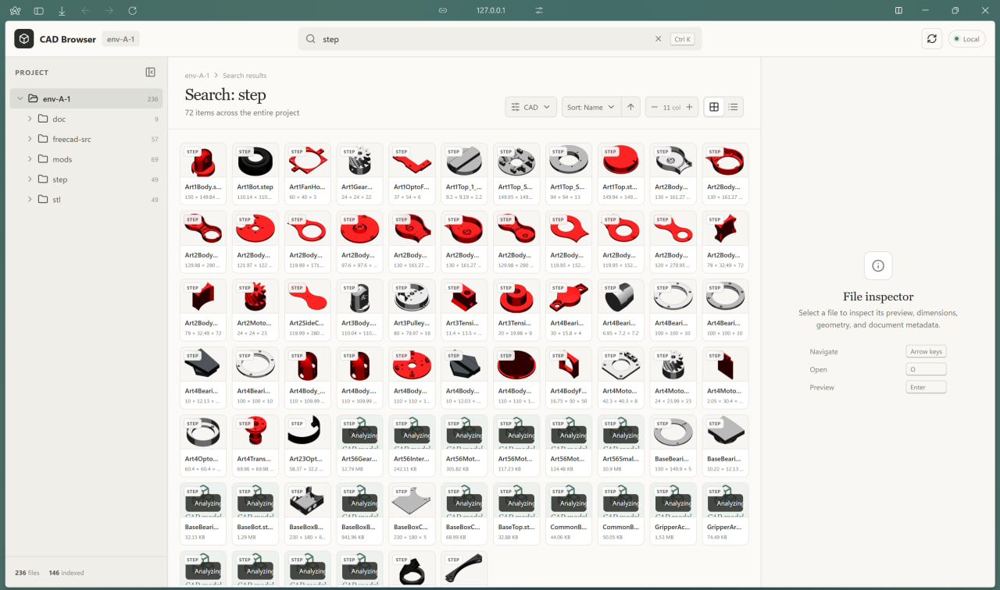

# CAD Browser

CAD Browser turns any local engineering project folder into a searchable visual file browser.

Run one command inside a project and CAD Browser opens a private local website with a folder tree, thumbnails, previews, engineering metadata, document text, and desktop file actions.

Everything runs on your computer. Project files are not uploaded.



## Quick start

Open a terminal inside the folder you want to browse:

```powershell
cd C:\engineering\project
npx @cadcrawl/cad-browser
```

CAD Browser starts at:

```text
http://127.0.0.1:6767
```

You can also pass a folder explicitly:

```powershell
npx @cadcrawl/cad-browser C:\engineering\project
```

Use the latest published version explicitly when needed:

```powershell
npx @cadcrawl/cad-browser@latest
```

## What it provides

- Navigable project folder tree.
- Grid and list file views.
- Tile density from 4 to 15 columns.
- Search across filenames, paths, PDF text, Markdown, and TXT content.
- Filtering by CAD, PDF, text, image, or other file types.
- Sorting by name, modification date, size, or type.
- CAD and drawing thumbnails generated locally.
- Detailed file inspector.
- Open files in their default desktop application.
- Reveal files in Windows Explorer, macOS Finder, or the platform file manager.
- Copy project-relative paths.
- Rebuild cached metadata and previews.

## Supported file types

| Type | Support |
|---|---|
| STEP / STP | Preview, bounding box, geometry, colors, model tree |
| STL | Preview, bounding box, geometry, available colors |
| 3MF | Preview, bounding box, geometry, available materials |
| PDF | First-page preview, page count, extracted text |
| Markdown (`.md`) | Content search, text preview, line/word/character counts |
| Text (`.txt`) | Content search, text preview, line/word/character counts |
| Images | Native thumbnail and preview |
| Other files | Folder browsing, metadata, Open and Reveal actions |

Text indexing reads up to the first 256 KB of each Markdown or TXT file. The inspector indicates when a document was truncated.

## Folder tree

The project tree follows standard file-manager behavior:

- Click a folder name to open that folder.
- Click the arrow beside a folder to expand or collapse its subfolders.
- Folders without subfolders do not show an expansion arrow.
- Opening a folder does not automatically change its expanded state.

## File inspector

Select a file to open the inspector.

Depending on the file type, it can show:

- file size and modification time
- analysis status
- bounding-box dimensions and coordinates
- mesh, vertex, and triangle counts
- materials and face colors
- STEP model structure
- PDF page count and extracted text
- Markdown and TXT statistics and content

Inspector actions:

- **Open** — launch the file in its default application.
- **Reveal** — select the file in the system file manager.
- **Copy path** — copy its project-relative path.
- **Rebuild metadata and preview** — invalidate the current analysis and process the file again.

Double-clicking a file card also opens the file in its default application.

## Search

Search covers the entire project, even when a subfolder is currently open.



It matches:

- filenames
- relative paths
- extracted PDF text
- Markdown content
- TXT content

## Keyboard shortcuts

| Shortcut | Action |
|---|---|
| `Ctrl/Cmd + K` | Focus project search |
| `/` | Focus project search |
| `Escape` | Close preview, clear search, or close inspector |
| Arrow keys | Move through visible files |
| `Enter` | Open the selected preview |
| `O` | Open the selected file |
| `R` | Reveal the selected file |

## Command options

```text
npx @cadcrawl/cad-browser [directory] [options]
```

| Option | Description |
|---|---|
| `--port <number>` | Local port. Default: `6767` |
| `--host <address>` | Bind address. Default: `127.0.0.1` |
| `--no-open` | Start without opening a browser window |
| `--help` | Show command help |

Examples:

```powershell
npx @cadcrawl/cad-browser . --port 7000
```

```powershell
npx @cadcrawl/cad-browser C:\engineering\archive --no-open
```

## Local cache

CAD Browser keeps generated metadata and previews outside the browsed project:

```text
~/.cadcrawl/cad-browser/projects/
```

The selected project folder is not modified.

Cached data is reused while the file size and modification time match. CAD render files also use source-hash validation through [`@cadcrawl/cad-toolbox`](https://www.npmjs.com/package/@cadcrawl/cad-toolbox).

Delete the cache folder at any time if you want CAD Browser to recreate all local data.

## Privacy

- Files remain on the local machine.
- The web interface is served locally.
- The default bind address is `127.0.0.1`.
- No CAD files or document contents are uploaded by CAD Browser.

## Requirements

- Node.js 20 or newer.
- A supported desktop browser.
- Windows is the primary platform; macOS and Linux file actions are also supported.

## Troubleshooting

### The port is already in use

Choose another port:

```powershell
npx @cadcrawl/cad-browser . --port 7000
```

### A preview is stale

Select the file and use **Rebuild metadata and preview** in the inspector.

### `npx` uses an older cached version

Run the latest version explicitly:

```powershell
npx @cadcrawl/cad-browser@latest
```

### Explorer or the default application does not open

Confirm that the file still exists and that its extension has a default desktop application configured.

## License

[PolyForm Noncommercial License 1.0.0](LICENSE.md)
